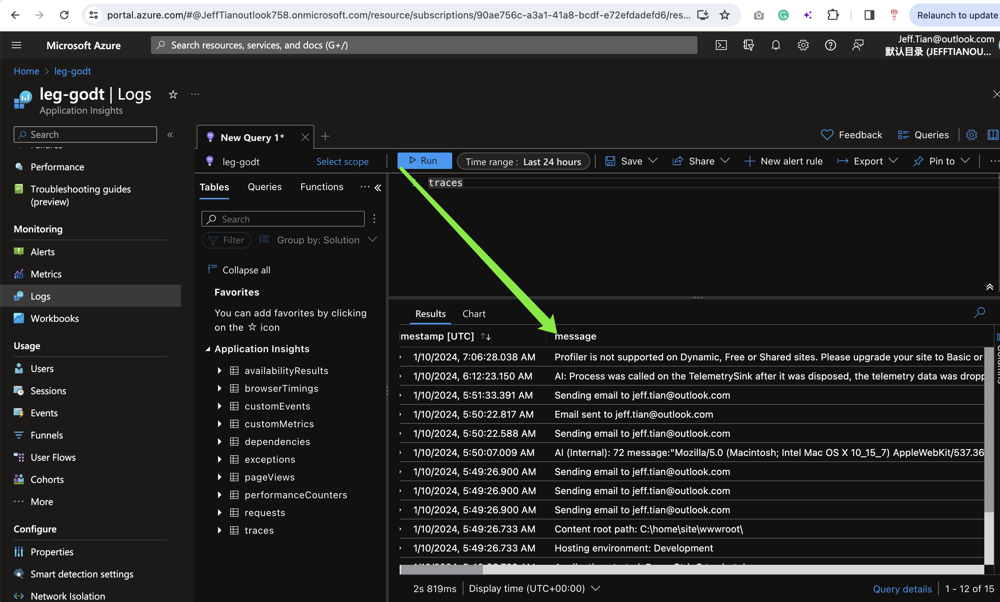

# leg-godt 好好玩乐

---

> 我的 dotnet core 玩乐场

## 查看日志

通过 [Azure Insights](https://portal.azure.com/#@JeffTianoutlook758.onmicrosoft.com/resource/subscriptions/90ae756c-a3a1-41a8-bcdf-e72efdadefd6/resourceGroups/leg-godt_group/providers/microsoft.insights/components/leg-godt/logs )，输入 `requests` 可以查看请求日志；输入 `traces` 可以查看应用日志。

